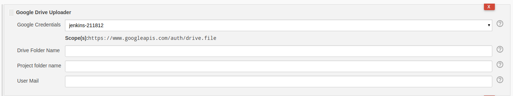

Jenkins Google Driver Uploader
===
This plugin allows you to upload artifacts to your google service account.

# Install

Create an HPI file to install in Jenkins (HPI file will be in
`target/google-drive-upload.hpi`).

    mvn clean package

# ScreenShot

# Thanks

[Marko Stipanov](https://github.com/mstipanov) for creating [Slack Plugin](https://github.com/mstipanov/google-drive-upload-plugin). This helps us a lot to create this plugin.